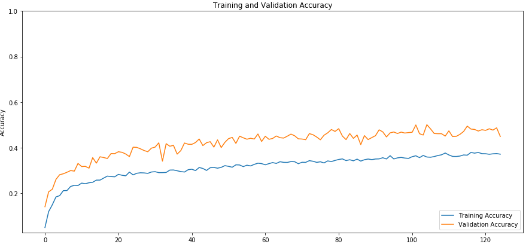

# DOG BREED CLASSIFICATION WITH MOBILNETS ARCHITECTURE

In this project, I implemented a deep learning architecture with the objective to predict the dog's breed from a set of images.

For doing this project I used the following resources:

> Howard, A. G., Zhu, M., Chen, B., Kalenichenko, D., Wang, W., Weyand, T., ... & Adam, H. (2017). Mobilenets: Efficient convolutional neural networks for mobile vision applications. arXiv preprint arXiv:1704.04861.

> Chi-Feng Wang. (Aug 13, 2018). A Basic Introduction to Separable Convolutions. Towards Data Science. Recovered From: https://towardsdatascience.com/a-basic-introduction-to-separable-convolutions-b99ec3102728

> Zehaos. (Nov 5, 2017). MobilNet. Github. https://github.com/Zehaos/MobileNet

> Aditya Khosla, Nityananda Jayadevaprakash, Bangpeng Yao and Li Fei-Fei. Novel dataset for Fine-Grained Image Categorization. First Workshop on Fine-Grained Visual Categorization (FGVC), IEEE Conference on Computer Vision and Pattern Recognition (CVPR), 2011

> Paddy. (Jul 25, 2017). Questions. How to calculate F1 Macro in Keras?. StackOverflow. Recovered From: https://stackoverflow.com/questions/43547402/how-to-calculate-f1-macro-in-keras

## Project Structure

```
- tests/
    data.ipynb
    model.ipynb
    preprocessing.ipynb
- assets/
- config.py
- data.py
- make_predictions.ipynb
- model.py
- predictions.py
- preprocessing.py
- trainer.py
- utils.py
```

The previous structure contains the following information:

* **tests:** This folder contain some Jupyter Notebooks used to validate the correct behavior of the different methods developed in the scripts.
* **assets:** This folder contains some screenshots that allow us to visualize the results in the project pipeline.
* **config:** This script contains the parameters' values used through the differents .py files.
* **data:** This script is in charge of reading and load the images, build the _input fn_ and define the data augmentation methods.
* **make_predictions:** This is a Jupyter Notebook open for anybody that want to make their own predictions.
* **model:** This script defines a model function, loss function and accuracy metrics needed to track the model performance.
* **predictions:** This script is developed in order to make easier the _own predictions_ process.
* **preprocessing:** This script contains the environment setup needed before training the model.
* **trainer:** This file contains the script to train and validate the model defined.
* **utils:** This file contains some utility methods.

## Model specifications and results

The architecture of this project is composed of two parts. The first one is a pre-trained model and the second one is a custom architecture, both based on _Mobilnet_.

**So, Why I use a pre-trained model?** Because the pre-trained models have their parameters more adjusted and the filters they have learned are more polished, in consequence, we can avoid the process of teaching the network those filters and the only thing that we should focus on is to adjust the other parameters to the specifications of our data set.

**How are the specifications of the pre-trained model?** The pre-trained model is an instance of MobilNet network, trained with imagenet weights this architecture is provided by Keras API. For this model, I freeze all trainable parameters to get the best feature maps of my dataset.

**How is the architecture of the custom model?** The custom model is a tiny mobilnet architecture, with 10 layers, one convolutional layer, one dense layer, four depthwise convolutional layers, and four pointwise layers. All layer was trained with rectifier linear function and batch normalization before each activation, except the last layer which has softmax activation.

**How is the complete model trained?** You can see the complete list of hyperparameters that I use for train the model in the  `config.yml` file. The more relevant parameters are.
* batch_size: 10
* depth_multiplier: 1
* learning_rate: 0.001
* loss: 'sparse_categorical_crossentropy'
* num_classes: 10
* num_epochs: 45
* width_multiplier: 1
* optimizer: Adam

**Bonus** The full architecture of _Mobilnet_ (V1) is available in the `data.py` file. If you want to try this network, you should change the following code.

* **_In trainer.py file_**:

Change these lines 

```
mobilnet_tiny = model.MobilNet_Architecture_Tiny(........
```
to 
```
mobilnet = model.MobilNet_Architecture(..........
```

and 

```
net = tf.keras.Sequential([
    base_model,
    mobilnet_tiny])
```
to
```
net = mobilnet
```

### Results
* **Training and Validation Accuracy**


* **Training and Validation Loss**


* **Training and Validation F1 Score**


* **Predictions in test set**


## How to use

This project is developed in Python 3 environment, you must install the following dependencies:

```
- Keras==2.2.4
- matplotlib==3.0.2
- numpy==1.16.1
- opencv-python==4.0.0.21
- scikit-learn==0.20.3
- scipy==1.2.1
- tensorflow-gpu==1.12.0
- tqdm==4.31.1
- urllib3==1.24.1
- wget==3.2
```

First of all, we need to clone the repository.
```
git clone https://github.com/SebasPelaez/dog-breed-classification-mobilnet.git
```

Next, we move to the folder and execute the preprocessing script.
```
cd dog-breed-classification-mobilnet
python preprocessing.py
```

This script executes 4 functions.

1. **download_data:** Creates the data directory and extract there the compressed file with the Standford Dog Dataset.
2. **extract_data:** Decompress the downloaded file.
3. **make_id_label_map:** Build a dictionary with the name of the dog's breed and a number representing the class, then save it in a .json file
4. **split_data:** Creates 3 different .txt files with the classes distribution. One file for training, one for validation and one for test the model.

At this point, we have the environment ready to train the model.

If we just want to use the predictor, we should download the pre-trained weights from [this link](https://www.dropbox.com/s/00rzhistyuyh3dt/dog_breed_classification_mobilnet_full.rar?dl=1) and then extract the .rar file in the project root folder.

The project structure should be like that.

```
.
.
.
- tests/
    .
    .
    .
- checkpoints
- config.py
.
.
.
```

If you don't want to download the pre-trained weights because you want to train the model from scratch, you should execute this code.

_If you download the weights and extract it in the root folder, I recommend you to delete checkpoints folder and then run this line._

```
python trainer.py -c config.yml
```

### How to use the predictor

Following the previous steps, we are ready to predict dog breeds. For do that you can go to [Jupyter Notebook](/make_predictions.ipynb) that I prepare for you.

## Notes

* Verify if your enviroment have all recommended dependencies.
* Change the config.yml to adapt the project parameters of your PC capacities.


## TODO

- [x] Create a script to configure the environment.
- [x] Build Mobilnet architecture and _model fn_ function.
- [x] Create data management and _input fn_ function.
- [x] Code wrap function to execute the train and test process.
- [x] Make Jupyter Notebooks with the unit test of some script functions.
- [x] Upload pre-trained weights.
- [x] Show metrics and model results.
- [x] Create a Jupyter Notebook with the test of predictions script.
- [x] Make predictions with different dog images.

_Feel free to make my comments, corrections or advice_